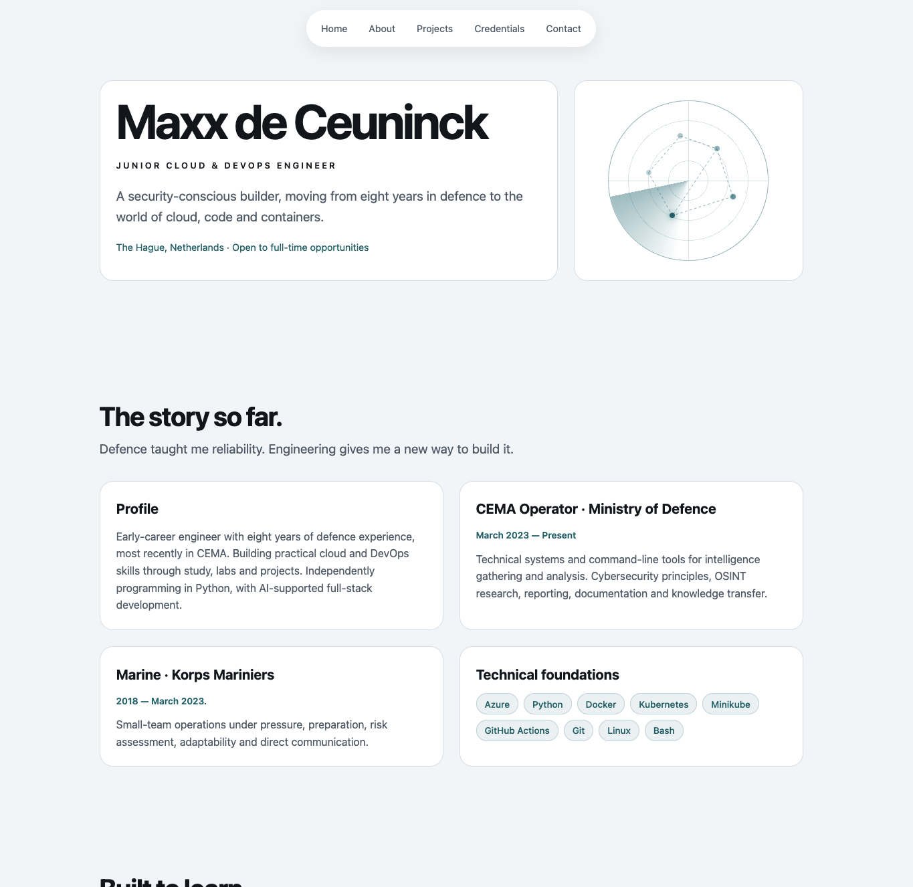

# portfolio-site

My personal portfolio, live at **https://maxxdeceuninck.dev**



I first built this site in Framer, then rebuilt it by hand to learn the full path from code to a live cloud service. This repo has the site itself plus everything needed to build and deploy it.

## Stack

- Plain HTML and CSS, no framework, no JavaScript
- nginx in a Docker container
- Google Cloud Run (europe-west4, Netherlands)
- Cloudflare for DNS

## Choices I made

- nginx runs as a non-root user. Site files are owned by root and read-only, so even a compromised web server can't change the site.
- `.dockerignore` is an allowlist, so only the two site files get into the image.
- Max 2 instances. Under heavy load the site may slow down, but the bill can't run away.
- The Cloudflare proxy is off, because Cloud Run domain mapping needs direct DNS for its certificate. That also means no Cloudflare DDoS protection, which I accept for a portfolio.
- The domain doesn't send email, so SPF and DMARC reject anything pretending to come from it.
- System fonts only, no external scripts or trackers.
- Respects reduced-motion settings and works with keyboard navigation.

## Run it locally

```bash
docker build -t portfolio-site .
docker run --rm -p 8080:8080 portfolio-site
```

Then open http://localhost:8080.

## Deploy

```bash
gcloud run deploy portfolio-site --source . --region europe-west4 --allow-unauthenticated --max-instances 2
```

Cloud Build builds the image from the Dockerfile, and Cloud Run serves it with a Google-managed certificate.

## Known limitations

- Cloud Run domain mapping is still in Preview, and it doesn't let me disable TLS 1.0/1.1. Firebase Hosting or a load balancer would fix that.
- Deploys are manual for now.
- No security headers yet (CSP, HSTS, X-Content-Type-Options).

## Next up

- Terraform for the infrastructure
- GitHub Actions for deploys, using Workload Identity Federation instead of service account keys
- Security headers through a custom nginx config

---

Built with AI as a learning partner. The design decisions and debugging are mine, and I can explain every line.
